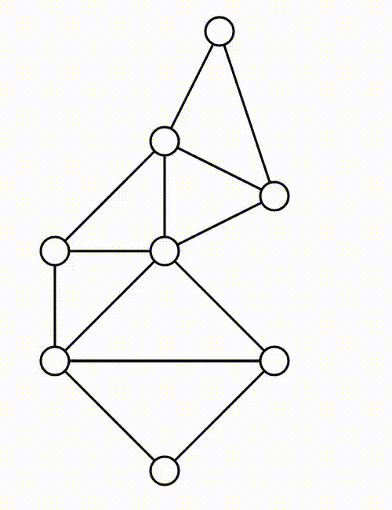

## hookean-springs-pytorch

Minimal implementation of Hookean springs in PyTorch.

```
python example.py
```

The state of the simulation is stored in `x`, a `float(n, 2)` tensor where `n` is the number of vertices. The script `example.py` simply prints `x` (this repository does not contain any visualization code at the moment).

