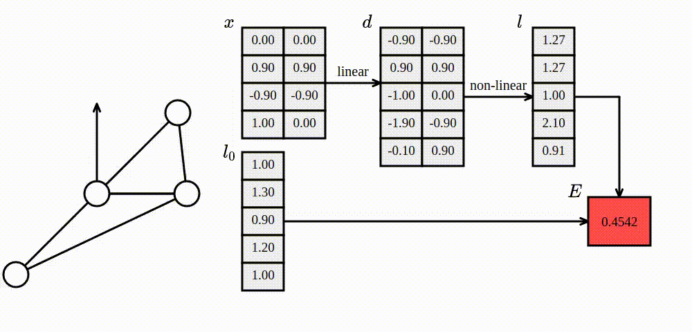
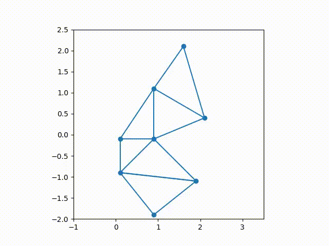

# hookean-springs-pytorch

Hookean springs in PyTorch.

The code in this repository shows how to compute the potential energy of a mass-spring system using differentiable tensor operations. Read more [here](https://medium.com/@juniorrojas/physics-based-simulation-via-backpropagation-on-energy-functions-6d3b0e93f5fb).



## examples

Tested with Python 3.7 and PyTorch 1.6.0.

Set your `PYTHONPATH` to run the examples.

```
export PYTHONPATH=.
```

### minimization loop

The state containing vertex positions is `x: float(n, 2)`, where `n` is the number of vertices. The script prints `x` after every optimization step.

```
python examples/example_no_render.py
```

### matplotlib visualization

```
python examples/example_render.py
```



## citation

This code was released as supplementary material for the paper [Deep reinforcement learning for 2D soft body locomotion](https://neurips2019creativity.github.io/doc/drlsbl-neurips-2019.pdf) to illustrate implementation details. To cite this in your research, please use the following BibTeX entry:

```bibtex
@conference{rojas2019-drl-sbl,
  title = {Deep reinforcement learning for 2{D} soft body locomotion},
  author = {Junior Rojas and Stelian Coros and Ladislav Kavan},
  booktitle = {NeurIPS Workshop on Machine Learning for Creativity and Design 3.0},
  year = {2019}
}
```
